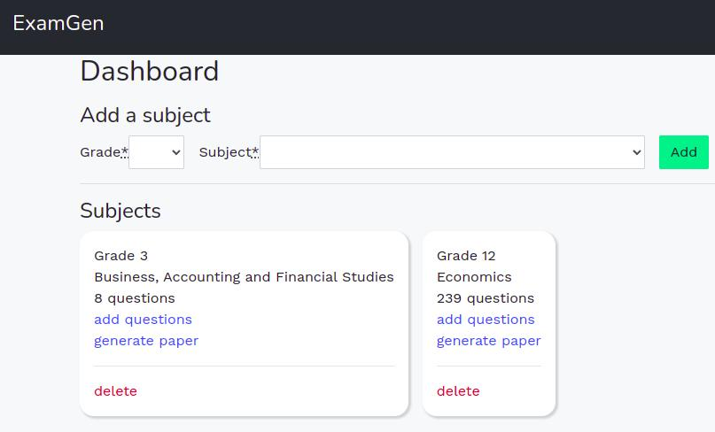

# ExamGen

## Description

My teacher friend Billy is not happy that way too much of his time is spent on deadling with Microsoft Word when creating exam papers. Using Ruby on Rails, ExamGen is created to automate the chores.

Using Pandoc to convert docx to markdowns, it can parse question banks into its PostgreSQL database while preserving images and formats like tables.

Preview of questions is available on the site by converting the markdowns to HTML. Users can then choose questions and download the generated docx with correct formatting.

A basic authentication and authorization system is implemented using Devise and Pundit gems.

The app is hosted on Heroku. Image files are stored on Cloudinary and are linked to model objects via Active Storage.

It was developed as the final project of my coding bootcamp.

## Usage

After logging in, the user can see a dashboard and add subjects if needed.

<kbd></kbd>

In the questions uploading page, user can download a demo question bank document or upload their documents for the app to parse. The "Upload Billy's document" section is only available for my friend's account and it parses documents with very specific formatting that my friend possesses.

<kbd></kbd>

In the document generation page, previews of questions are available and can be filtered by topic. User can choose the questions they want and download the product (.docx) by clicking the generate button.

<kbd>]</kbd>

Screenshot of a generated document.

<kbd></kbd>

## License

Licensed under the MIT license.
